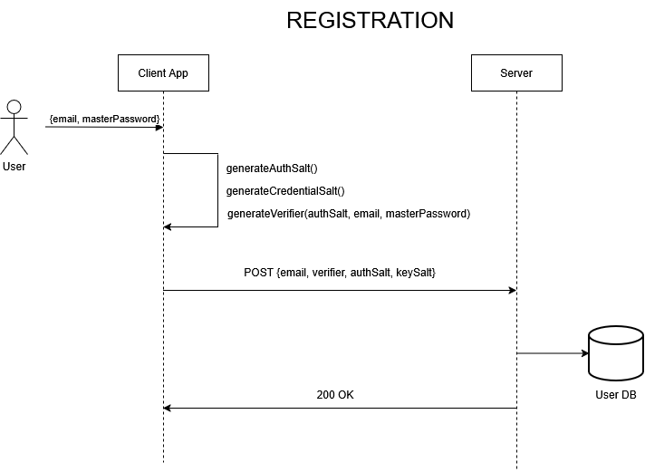
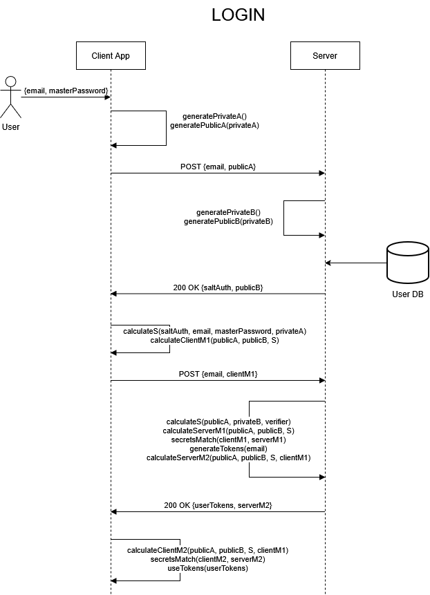
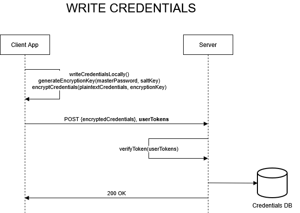

# SeguraPass
A free-to-use, secure, zero-knowledge, end-to-end encrypted online password manager built in Java

## Table of Contents
- [Introduction](#introduction)
- [Why SeguraPass](#why-segurapass)
- [Architecture](#architecture)
- [Tech Stack](#tech-stack)
- [Application Screenshots](#application-screenshots)
- [Challenges](#challenges)
- [Security Considerations](#security-considerations)
- [Installation Instructions](#installation-instructions)

## Introduction
SeguraPass is an online desktop-based password manager built with Java, JavaFX and PostgreSQL, designed with one primary goal:

**Your passwords should belong only to you, and not the server, not the cloud and not the application developer.**

Unlike traditional password managers, SeguraPass follows a zero-knowledge security model:

- The server never sees any of your passwords
- The server never stores a hash of any of your passwords
- The server never stores a master password derivative
- The server never receives unencrypted credentials
- All sensitive data is encrypted before leaving your device
- All sensitive data is decrypted only on your device

Authentication is handled using Secure Remote Password (SRP-6a), a cryptographic protocol that ensures:

- The master password is never transmitted
- The server cannot derive the master password in any way
- The client and server mutually authenticate
- The login flow resists MITM attacks
- Even if the database is compromised, login secrets remain unusable

Credential storage is protected with AES-256-GCM using keys derived from your master password and a per-user salt. Only the encrypted blobs ever reach the backend.

SeguraPass therefore includes:

- Strong cryptography
- Zero-knowledge architecture
- End-to-end encryption
- No cloud trust required
- No telemetry or data collection

## Why SeguraPass
Most password managers currently out fall into one of two categories:

### 1. Cloud-first password managers
- They receive your data unencrypted, encrypting it on the server instead of the client
- They control how your key is derived
- They often send telemetry
- They often rely on storing hashes of master passwords for user authentication
- Many use PBKDF2 or other outdated KDFs
- They rely heavily on security-by-policy rather than security-by-design

These systems can technically function, but users ultimately have to trust:

- The company’s servers
- The implementation of its crypto
- That no one has added or will add a backdoor
- That breaches won’t expose sensitive data
- That the master password hash is adequately protected

Any system that features trust as a necessary component is a fundamentally insecure one, which history has repeatedly proven.

### 2. Local password managers

These avoid cloud trust but introduce other problems:

- No syncing
- Local-only backups
- Manual export/import
- High risk of data loss
- No multi-device access
- Easy to corrupt or lose vaults

When choosing the type of password manager to use, clients are constantly forced to compromise between the convenience and insecurity of typical cloud managers, and the security but lack of reliability of local ones. 

SeguraPass is built to provide the best of both worlds without compromising on security. It was built with a very specific goal in mind: 

**Even in the event of compromise, backdooring, malicious activity or leaking of data on the server, the client must remain secure.**

This is due to two fundamental properties of SeguraPass:
  
  **1. Zero-knowledge authentication.** The master password never leaves the client device and only a verifier from which the password cannot be reverse-engineered is stored on the server.
  
  **2. Client-side end-to-end encryption.** All the credentials are encrypted before leaving the client device, and they are only decrypted after coming back to the device.

## Architecture

A sophisticated application architecture was devised to satisfy the secure properties of SeguraPass. The base operations of the application that need to be implemented securely are:

- Registering as a new user
- Logging in as an existing user
- Writing credentials
- Reading credentials

The base operations are described below. Note: **N** and **g** are fixed primes used during the SRP process, derived from the **rfc5054_3072** standard

### 1. Registering as a new user

For both registration and login, SeguraPass uses SRP-6, a proven password-authenticated key exchange protocol that allows secure registration/login without ever sending the password to the server. 

The registration flow is the following:

1. The user specifies an email address and a master password
2. The client generates the following:
   1. A random **authorization salt** that will be used in future authentication flows
   2. Another random **key salt** that will be used with the master password to make the credential encryption key
   3. A verifier **v = g^x mod N**, where **x = H(saltAuth | masterPassword)**, from which the master password cannot be reverse-engineered. 
   4. A randomly generated **device ID** (UUID) that will identify the particular device to the server, for multi-device access purposes
3. The client sends only **authorization salt, key salt, v** and **device ID** to the server, making master password recovery by third parties impossible
4. The user has now successfully registered to the SeguraPass service

The master password **never** leaves the device, as the server only stores the email address, salts, device ID and verifier. This is sufficient for the user later logging in successfully, while attackers cannot reverse engineer master credentials from the verifier or perform offline attacks, as the verifier itself never leaves the server.

Before the user can use the service, they must verify their account by clicking on a randomly generated verification link that will be sent to their email address.

### 2. Logging in as an existing user

During login, the master password again never leaves the device. The authentication of the user is performed using proof messages and public key parameters, in a way that sensitive data on both the client and server side are never exposed to the public. 

The login flow is the following:

1. The client randomly generates a private integer **a** and a public integer **A**, where **A = g^a mod N**. The public component **A** along with the user's **email** and **device ID** are sent to the server
2. The server randomly generates a private integer **b** and a public integer **B**, where **B = ( k * v  +  g^b mod N ) mod N** and **k = H( pad(N) || pad(g) )**. The server ephemerally stores these values tied to the user's account for a short period and returns the public value **B** to the client as a response
3. The client uses its own private value **a** with their master password and the public values **A** and **B** to generate a proof message **M1** that will be sent to the server
4. The server uses its own private value **b** with the user's stored verifier and the public values **A** and **B** to generate its own proof message **M1** that must be the same as the one generated and sent by the client. If the two are the same, the server generates a short-lived JWT, a refresh token and a new proof message **M2** so the client can also be sure the server is legitimate. These are then returned to the client. If the proof messages **M1** were not the same, the SRP verification has failed and the user has not been authenticated
5. After the client receives the tokens and the server's proof message **M2**, it generates its own **M2** that must be the same as the one received for the client to be sure about the server's identity. If the two match, the client accepts the tokens and uses those as authorization methods when communicating with the server

If anything is tampered with, be it on the server or the client side, the authentication flow fails and the login is refused.

The result is a mutually authenticated session where the client then uses a short-term JWT and a longer-lived refresh token (which is also stored on server and can be revoked) to do the read/write credential operations which require authorization.

### 3. Writing credentials

Once the user is logged in, the client needs a stable cryptographic key for AES encryption/decryption.

SeguraPass always derives the same cryptographic key locally using:

- **Argon2id** (memory-hard password hashing)
- User's individual **key salt**

With the following Argon2 parameters:

- 64 MB of memory
- 3 iterations
- 1 lane of parallelism

These parameters make it so any attempts to crack the hash are computationally expensive. 

The output of the operation is a 256-bit AES key which is used to encrypt the credentials before they are sent to the server. Neither the key nor any of its derivatives ever leave the client device.

When a write operation is performed (creating or updating credentials), a new 12-byte IV is randomly generated and used with the key to encrypt the credentials before they are sent to the server. The server only stores the credential's ciphertext and its associated IV so users can retrieve and decrypt them locally in the future.

### 4. Reading credentials

The authenticated user retrieves the encrypted credentials and its associated IVs from the server and simply performs the decryption using the same cryptographic key as obtained during the write operation.

## Tech Stack

Frontend/Client:

- Java 17
- JavaFX 21 - Used for creating the GUI, including responsive forms, tables and dialogs
- ControlsFX & ValidatorFX - Enhance UI components and form validation
- BootstrapFX & Ikonli - Styling and icons for a polished interface

Backend/Server:

- Java/Spring – Handles authentication, credential storage and API endpoints
- PostgreSQL – Stores encrypted credential blobs, SRP verifiers and user sessions

Security and Cryptography:

- BouncyCastle – Provides SRP-6 implementation, AES-256-GCM encryption and Argon2 key derivation
- Secure Remote Password (SRP-6) – Ensures the master password is never transmitted and server cannot derive it
- AES-256-GCM – Used for end-to-end encryption for all credentials stored on the server
- Argon2 – Derives encryption keys securely from the master password with per-user salts

Packaging / Deployment:

- jlink & jpackage – Creates custom runtime images and packages the application for Windows distribution without requiring a separate JDK installation
- Inno Setup – Used to create a full installer EXE for users, including automated removal of previous versions

## Application Screenshots

## Challenges

### 1. Secure Authentication with SRP-6a

One of the chief challenges was implementing a secure authentication method. The original idea was generating an RSA keypair during registration and storing it on the server, where the private key would be encrypted by the user's master password before leaving the client device. When logging in, the server would generate a random nonce and provide the user with their own encrypted private key so they can digitally sign the once once they decrypt the key using a key generated by the master password. Since this method was prone to offline attacks, it was quickly scrapped for a more robust authentication method, namely the SRP protocol. 

The other challenge was implementing SRP securely on the client and server, which required careful handling of large integers, hashing and ephemeral values. The challenge was solved by temporarily storing the ephemeral values in the database for very short periods, linking them to the accounts of users trying attempting authentication. The main lesson of this part of the service is using battle-tested crypto libraries like BouncyCastle, as developing your own from scratch is extremely risky.

### 2. End-to-End Encryption of Credentials

The other main issue was ensuring that no plaintext credentials or cryptographic keys ever left the client device. This was achieved by storing a randomly generated salt per-user when first registering to the service, which was used with the master password for making the 256-bit AES key. When doing write operations on the credentials, this key was then used along with a randomly generated 12-byte IV to encrypt the credentials before sending them and their respective IVs to the server, thus establishing end-to-end encryption.

### 3. Packaging & Distribution

Creating a standalone executable required combining **jlink** to create a custom runtime image and **jpackage** to bundle the app. Initially, graphics pipeline errors and missing modules caused the app to failso careful module selection and runtime image construction were key.

After a base app structure was created, an **Inno Setup** script bundled it into a proper installer executable, which is useful when updating the app as it automatically removes previously installed versions.

### 4. Handling Updates

The challenge came from determining a robust way to notify the client applications of an update in case they were not up to date, and then prompting the users to download and install the new versions. The chosen way to do it became using a pull architecture, where the client pings the server for updates upon each app startup. For this purpose, a separate endpoint was made on the server that contains the current version number, release date and download link of the latest version of the client app. If a major version release was made in the meantime, the user is prompted to install the new version from the provided download link before they can continue using the app.

### 5. Secure Client-Server Communication

Even though the service is zero-knowledge, and the SRP architecture and end-to-end credential encryption essentially make any MITM attacks redundant, using HTTPS and validating all server responses was essential. Since client authentication hinges on JWTs, it was absolutely imperative to use HTTPS, which was achieved by tunneling the traffic using Cloudflare Tunnels, which had the added benefit of minimizing malicious traffic.

### 6. General Lessons Learned

While designing with a security-first mindset often increases complexity, it drastically reduces risk of sensitive data leaks or the damage done in case they occur.

A clear separation of concerns (UI, encryption, API, authentication) simplifies debugging and testing.

Documenting cryptographic choices, assumptions and architecture helps users and future maintainers understand and trust the system.

## Security Considerations

## Installation Instructions

The user should simply download the executable file (or the zip file and extract the same executable from within) and follow the on-screen instructions in the wizard to install the app.

It is recommended to check the SHA-256 signature locally for the downloaded files before initiating the installation. These can be found in the files **sha256_exe.txt** and **sha256_zip.txt** for the exe installer and the zip archive respectively. These can also be found here, and are the following:

- segurapass-installer.exe: 5afdff02705f83a0496b6e2326bbfe1e266067430a3f0e6042982169c9357f9e (SHA-256)
- segurapass-installer.zip: 35d67883a37b7a7362bac39cfd10e5f9a3bc182033838f918c2136442be9ab93 (SHA-256)
